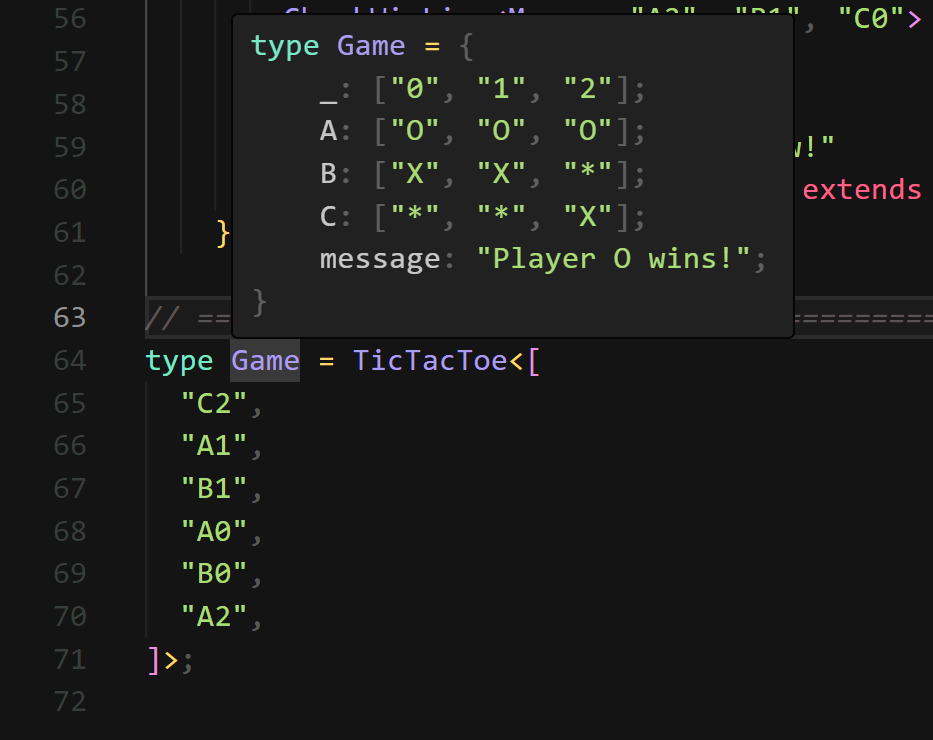
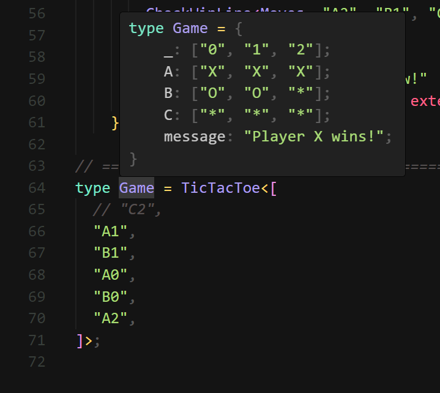
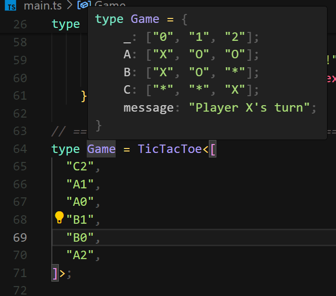
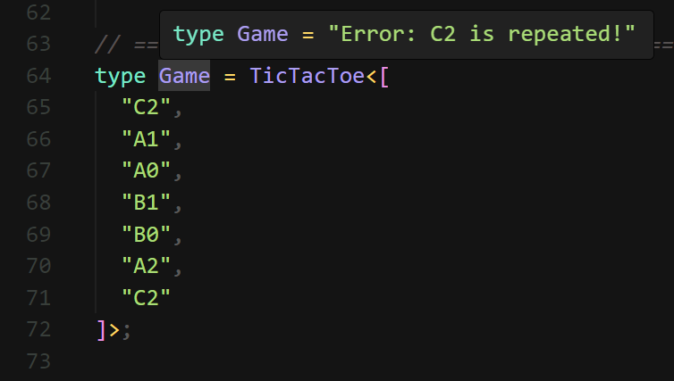
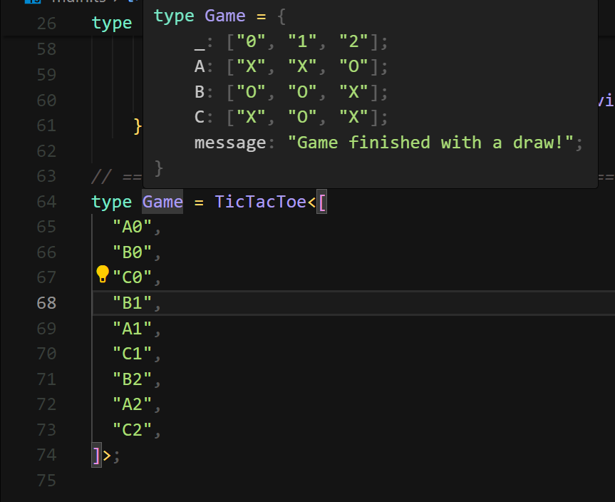

# TypeScript ONLY TicTacToe

It compiles to literally 0 js
```sh
bun build main.ts
```
```sh
tsc main.ts
```

_Tested on tsc version 5.5.4_

## How to play
Just edit the game type to start playing!
```ts
type Game = TicTacToe<[
  "C2",
  "A1",
  "B1",
  "A0",
  "B0",
  "A2",
]>;
```

To view game state hover over this type in your IDE
> 

## Some other screenshots:
### X Wins
> 

### X's turn
> 

### Game error
> 

### Draw
> 
